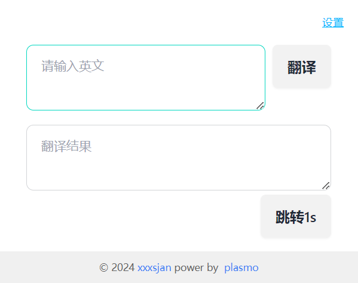

# 工具集（ultra-extension）

基于 [Plasmo](https://docs.plasmo.com) 的 Chrome 扩展，集成日常开发常用小工具。

## 功能

| 功能 | 说明 | 状态 |
| --- | --- | --- |
| 百度翻译 | 弹窗输入英文，调用百度通用翻译 API | ✅ |
| GitHub → github1s | 在 GitHub 仓库页一键跳转在线编辑器 | ✅ |
| 外站自动跳转 | 访问指定外站时自动跳转 | ✅ |
| 抖音消息 | 获取抖音聊天消息 | 🔨 开发中 |

翻译凭证在扩展「设置」页配置（`APP ID` / 密钥），数据仅保存在本地 `chrome.storage`。

申请地址：[百度翻译开放平台](https://fanyi-api.baidu.com/choose)

## 技术栈

- Plasmo · React · TypeScript
- Tailwind CSS · daisyUI

## 环境要求

- Node.js 18+（推荐 18 / 20 LTS）
- pnpm

## 开发

```bash
# 安装依赖
pnpm i

# 启动开发（热更新）
pnpm dev
```

Chrome 加载扩展：

1. 打开 `chrome://extensions/`，开启「开发者模式」
2. 「加载已解压的扩展程序」→ 选择 `build/chrome-mv3-dev`
3. 固定插件图标，打开「设置」填写百度翻译 `APP ID` 与密钥

> 若 `pnpm i` 后 `sharp` 安装失败（常见于 GitHub 下载超时），可先配置镜像再重建：
>
> ```powershell
> $env:sharp_binary_host="https://npmmirror.com/mirrors/sharp"
> $env:sharp_libvips_binary_host="https://npmmirror.com/mirrors/sharp-libvips"
> pnpm rebuild sharp
> ```

## 生产构建

```bash
pnpm build
```

加载目录改为：`build/chrome-mv3-prod`

## 截图



## 参考

- [Chrome 扩展文档](https://developer.chrome.com/docs/extensions/reference/)
- [Plasmo 文档](https://docs.plasmo.com)
- [百度翻译 API 文档](https://fanyi-api.baidu.com/doc/21)
